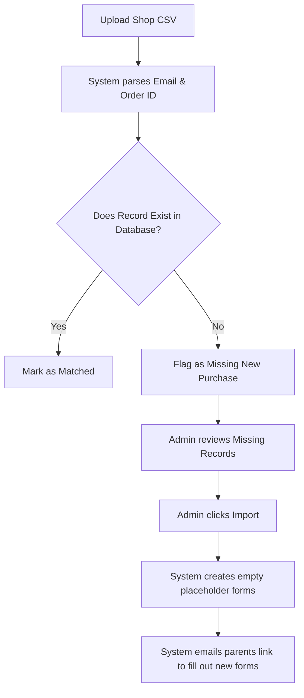

# 3.1 Sales Data Reconciliation

## Overview
**Function:** The Reconciliation tool is the bridge between your external shop (where parents pay) and Camp Command (where you manage the camp). It ensures every single purchased ticket has a corresponding player record.

## Reconciling Shop Data
**Action:**
1. Export a complete CSV of sales data from your external shop.
2. Navigate to **Reconciliation** on the left menu.
3. Drag and drop (or click to upload) your shop's CSV file into the upload zone.
4. The system will automatically compare your shop's rows against its internal database.
5. Review the results in the table below:
   - **Matched:** The record exists in both places. All good!
   - **Missing from Database (Blue):** These are new purchases. Select them and click **Import Selected**.
   - **Mismatched (Amber):** There is a discrepancy (e.g., the parent changed their email address). Review these manually.

**Impact:** Guarantees absolute data integrity. If a parent buys a ticket in your shop, this tool ensures they are never forgotten, and completely eliminates the risk of missing a child due to a sync failure.
