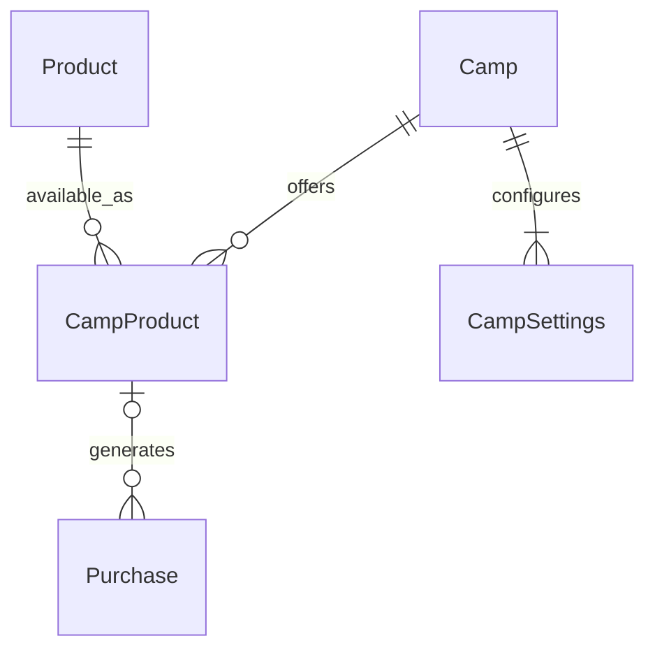

# Data Model: Camp and Settings Management

This data model describes the key entities and their relationships relevant to the "Camp and Settings Management" feature, based on `specs/005-camp-and-settings-management/spec.md`. It focuses on the entities that organisers will manage through the admin settings UI.

## Entities

### Camp

Represents a hockey camp, serving as the top-level scope for events.

-   `id`: Primary key (UUID/Integer)
-   `name`: (String) e.g., "CIHA Swedish Hockey Camp 2027 – Week 1"
-   `year`: (Integer) The year the camp takes place.
-   `status`: (String, Enum) e.g., 'active', 'deactivated', 'archived'. Used for soft-delete/deactivation.
-   `created_at`: (Timestamp)
-   `updated_at`: (Timestamp)

### Product

Represents a sellable item (e.g., "Full Camp Registration", "Goalie Session").

-   `id`: Primary key (UUID/Integer)
-   `name`: (String) e.g., "Full Camp Registration"
-   `description`: (String, Optional)
-   `base_price`: (Decimal) The default price of the product.
-   `created_at`: (Timestamp)
-   `updated_at`: (Timestamp)

### CampProduct

Represents a specific `Product` offered for a specific `Camp`, allowing for camp-specific pricing and availability.

-   `camp_id`: Foreign key to `Camp.id` (Part of composite primary key)
-   `product_id`: Foreign key to `Product.id` (Part of composite primary key)
-   `price`: (Decimal) The actual price of this product for this specific camp.
-   `status`: (String, Enum) e.g., 'active', 'inactive'.
-   `created_at`: (Timestamp)
-   `updated_at`: (Timestamp)
-   **Note**: Changes to `CampProduct.price` MUST NOT retroactively alter historical `Purchase` records (FR-007). This implies that `Purchase` records will capture the `CampProduct` price at the time of purchase, or `CampProduct` entries might be versioned.

### CampSettings

Stores camp-specific configuration settings, such as reminder intervals.

-   `camp_id`: Primary key (Foreign key to `Camp.id`)
-   `reminder_interval_days`: (Integer) Interval in days for sending reminders.
-   `max_reminders`: (Integer) Maximum number of reminders to send.
-   `created_at`: (Timestamp)
-   `updated_at`: (Timestamp)

## Relationships

The following diagram illustrates the relationships between the key entities:

*Note: The relationship `CampProduct o|--o{ Purchase` is conceptual and indicates that purchases are made based on CampProduct configurations, with historical immutability.*

-   **Camp** `(1)` -- `(Many)` **CampProduct**: A camp can offer many specific products.
-   **Product** `(1)` -- `(Many)` **CampProduct**: A product can be offered across many camps.
-   **Camp** `(1)` -- `(1)` **CampSettings**: Each camp has one set of specific settings.
-   **CampProduct** `(1)` -- `(Many)` **Purchase**: Purchases are conceptually linked to the `CampProduct` at the time of purchase, ensuring historical pricing is maintained (FR-007).

## Validation Rules & Business Logic Notes

-   **FR-007 Historical Immutability**: When `CampProduct.price` is updated, existing `Purchase` records MUST retain the price they were created with. New `Purchase` records will use the updated price. This suggests either a snapshot of `CampProduct` details within `Purchase` or a versioning mechanism for `CampProduct`.
-   **Soft Delete for `Camp` and `Product`**: Attempting to delete a `Camp` or `Product` that has associated `Purchase` records will be prevented. Instead, a "soft delete" or "deactivate" mechanism (`status` field) will be used to mark these entities as inactive, preserving historical data integrity.
-   **Required Fields**: `Camp.name`, `Camp.year`, `Product.name`, `Product.base_price`, `CampProduct.price`, `CampSettings.reminder_interval_days`, `CampSettings.max_reminders` are required.