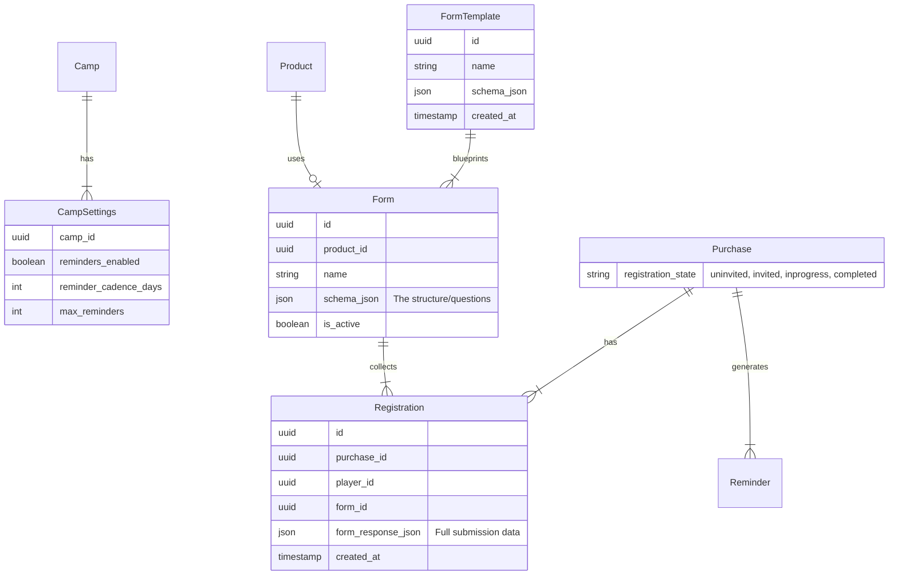

# Data Model: Registration and Reminders (Dynamic Forms)

## Entity Relationship Diagram (Mermaid)



## Table Definitions

### 1. `FormTemplates`
Library of reusable form structures.

| Column | Type | Description |
| :--- | :--- | :--- |
| `id` | `UUID` | Primary Key |
| `name` | `TEXT` | e.g. "Standard 3-Day Camp Form" |
| `schema_json` | `JSON` | UI definition (questions, types, images, validation) |
| `created_at` | `DATETIME` | |

### 2. `Forms`
Live instances of forms attached to products.

| Column | Type | Description |
| :--- | :--- | :--- |
| `id` | `UUID` | Primary Key |
| `product_id` | `UUID` | Foreign Key to `Products` |
| `name` | `TEXT` | internal reference name |
| `schema_json` | `JSON` | The structure used for this specific product |
| `created_at` | `DATETIME` | |

### 3. `Registrations` (Updated)
Links a player to a purchase and stores the dynamic form data.

| Column | Type | Description |
| :--- | :--- | :--- |
| `id` | `UUID` | Primary Key |
| `purchase_id` | `UUID` | Foreign Key to `Purchases` |
| `player_id` | `UUID` | Foreign Key to `Players` (Core System Data) |
| `form_id` | `UUID` | Foreign Key to `Forms` (Architecture link) |
| `form_response_json`| `JSON` | The actual answers (Medical, Kit, Consents) |
| `created_at` | `DATETIME` | |
| `updated_at` | `DATETIME` | |

*Note: Core fields like First Name, Last Name, and DOB are extracted and stored in the `Players` table (defined in 001) for indexing and system-wide identity.*

### 4. `CampSettings`
*(Unchanged from original design)*

| Column | Type | Constraints | Description |
| :--- | :--- | :--- | :--- |
| `camp_id` | `UUID` | PK, FK | Link to parent Camp |
| `reminders_enabled`| `BOOLEAN` | Default `true` | Main toggle |
| `reminder_cadence_days`| `INTEGER` | Default `7` | How often to nag |
| `max_reminders` | `INTEGER` | Default `3` | Stop after N tries |

## Enums / States

### `Purchase.registration_state`
- `uninvited`: Initial state.
- `invited`: Magic link generated and email sent.
- `inprogress`: Link clicked, form viewed.
- `completed`: Form successfully submitted.

## JSON Schema Structures

### `Form.schema_json` Example
```json
{
  "sections": [
    {
      "title": "Medical",
      "fields": [
        {
          "id": "med_asthma",
          "type": "boolean",
          "label": "Do you suffer from Asthma?"
        },
        {
          "id": "med_notes",
          "type": "textarea",
          "label": "Additional Notes"
        }
      ]
    },
    {
      "title": "Kit",
      "fields": [
        {
          "id": "jersey_size",
          "type": "select",
          "options": ["S", "M", "L", "XL"],
          "image_url": "https://.../size-chart.png"
        }
      ]
    }
  ]
}
```

### `Registration.form_response_json` Example
```json
{
  "med_asthma": true,
  "med_notes": "Usage of inhaler required before exercise",
  "jersey_size": "M",
  "digital_signature_name": "Sarah Smith",
  "digital_signature_timestamp": "2024-05-20T10:00:00Z"
}
```
