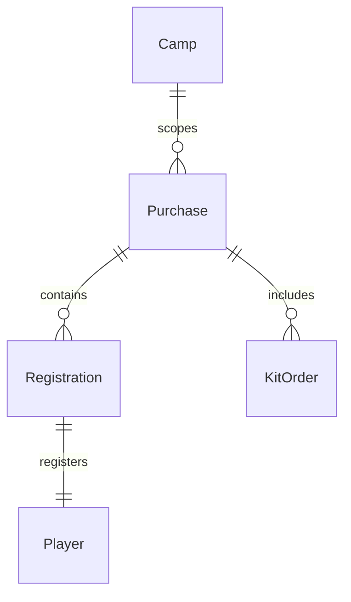

# Data Model: Organiser Dashboards and Reports

This data model describes the key entities and their relationships relevant to the Organiser Dashboards and Reports feature, based on `specs/004-organiser-dashboards-and-reports/spec.md`. It primarily focuses on the data consumed by the reporting functionalities.

## Entities

### Camp

Represents a hockey camp, serving as the top-level scope for all related data.

-   `id`: Primary key (UUID/Integer, details from 001-d1-database-schema)
-   `name`: (String) e.g., "CIHA Swedish Hockey Camp 2026 – Week 1"
-   `startDate`: (Date)
-   `endDate`: (Date)
-   ... (other camp-specific fields from 001-d1-database-schema)

### Purchase

Represents a completed purchase transaction, linking to registrations and kit orders.

-   `id`: Primary key (UUID/Integer)
-   `camp_id`: Foreign key to `Camp.id`
-   `registration_state`: (String, Enum) Current status of the registration process.
    -   **Validation**: MUST be one of: 'uninvited', 'invited', 'in_progress', 'completed'.
-   `guardian_name`: (String) Name of the guardian who made the purchase.
-   `guardian_email`: (String) Email of the guardian.
-   ... (other purchase-specific fields from 001-d1-database-schema)

### Registration

Represents a player's registration for a specific camp, linked to a purchase.

-   `id`: Primary key (UUID/Integer)
-   `purchase_id`: Foreign key to `Purchase.id`
-   `player_id`: Foreign key to `Player.id`
-   `camp_id`: Foreign key to `Camp.id`
-   `date`: (Date) Specific date for attendance (if applicable for daily registration).
-   ... (other registration-specific fields from 001-d1-database-schema)

### Player

Represents a player registered for a camp.

-   `id`: Primary key (UUID/Integer)
-   `registration_id`: Foreign key to `Registration.id` (if 1:1)
-   `name`: (String) Player's full name.
-   `age_group`: (String) Player's age group.
-   `medical_information`: (String, Optional) Any relevant medical details for the player.
-   ... (other player-specific fields from 001-d1-database-schema)

### KitOrder

Represents a specific item ordered as part of a kit for a player.

-   `id`: Primary key (UUID/Integer)
-   `purchase_id`: Foreign key to `Purchase.id`
-   `item_type`: (String) e.g., 'Jersey', 'Shorts'.
-   `size`: (String) e.g., 'S', 'M', 'L', 'XL'.
-   `quantity`: (Integer) Number of items of this type and size.
-   ... (other kit order-specific fields from 001-d1-database-schema)

## Relationships

The following diagram illustrates the relationships between the key entities:

-   **Camp** `(1)` -- `(Many)` **Purchase**: A camp can have many purchases.
-   **Purchase** `(1)` -- `(Many)` **Registration**: A purchase can include multiple player registrations.
-   **Purchase** `(1)` -- `(Many)` **KitOrder**: A purchase can include multiple kit orders.
-   **Registration** `(1)` -- `(1)` **Player**: Each registration is for one specific player.

## Validation Rules

-   `Purchase.registration_state` MUST be one of the predefined values: 'uninvited', 'invited', 'in_progress', 'completed'.