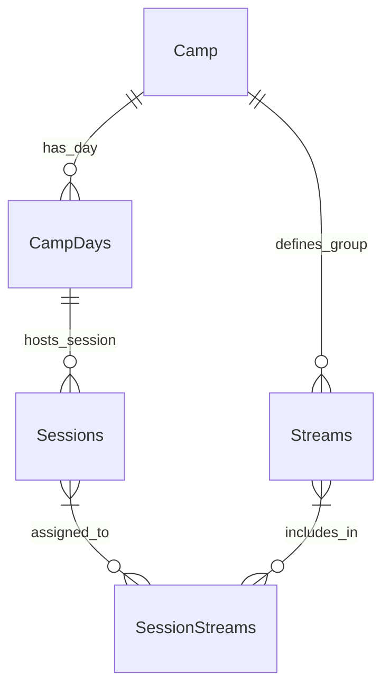

# Data Model: Camp Day Planner

This data model describes the new entities and their relationships relevant to the "Camp Day Planner" feature, based on `specs/006-camp-day-planner/spec.md` and the provided SQL schema in FR-001.

## Entities

### Camp

(Existing entity, acts as the parent for all schedule-related data.)
- `id`: Primary key (UUID/Integer)
- ... (other existing Camp fields)

### CampDays

Represents a single day within a camp for which activities are scheduled.

-   `id`: Primary key (INTEGER AUTOINCREMENT)
-   `camp_id`: Foreign key to `Camps.id` (INTEGER NOT NULL)
-   `date`: (DATE NOT NULL) The specific date of the camp day.
-   `label`: (TEXT) e.g., "Day 1", "Friday" (Optional)
-   `status`: (TEXT, Enum) e.g., 'active', 'archived'. Used for soft-delete/deactivation.

### Streams

Represents a participant group (e.g., by age or skill level) to which sessions can be assigned.

-   `id`: Primary key (INTEGER AUTOINCREMENT)
-   `camp_id`: Foreign key to `Camps.id` (INTEGER NOT NULL)
-   `name`: (TEXT NOT NULL) e.g., "9–14 Elite", "Seniors"
-   `status`: (TEXT, Enum) e.g., 'active', 'archived'. Used for soft-delete/deactivation.

### Sessions

Represents a scheduled block of time for an activity within a `CampDay`.

-   `id`: Primary key (INTEGER AUTOINCREMENT)
-   `camp_day_id`: Foreign key to `CampDays.id` (INTEGER NOT NULL)
-   `name`: (TEXT NOT NULL) e.g., "On-ice skills", "Off-ice conditioning"
-   `description`: (TEXT) (Optional)
-   `start_time`: (TEXT NOT NULL) Format "HH:MM"
-   `end_time`: (TEXT NOT NULL) Format "HH:MM"
-   `location`: (TEXT) (Optional)

### SessionStreams

A join table linking `Sessions` to `Streams`, indicating which streams are assigned to a particular session.

-   `session_id`: Foreign key to `Sessions.id` (INTEGER NOT NULL)
-   `stream_id`: Foreign key to `Streams.id` (INTEGER NOT NULL)
-   `PRIMARY KEY`: (`session_id`, `stream_id`)

## Relationships

The following diagram illustrates the relationships between the key entities:

-   **Camp** `(1)` -- `(Many)` **CampDays**: A camp has many scheduled days.
-   **Camp** `(1)` -- `(Many)` **Streams**: A camp defines multiple participant streams.
-   **CampDays** `(1)` -- `(Many)` **Sessions**: A camp day hosts many sessions.
-   **Sessions** `(Many)` -- `(Many)` **Streams**: Sessions can be assigned to multiple streams, and a stream can participate in multiple sessions (via `SessionStreams` join table).

## Validation Rules & Business Logic Notes

-   **Scheduling Overlaps (FR-005)**: The UI (and implicitly, the backend API) MUST prevent or visually flag scheduling overlaps for sessions assigned to the same `Stream` on the same `CampDay`. This requires validation logic when creating or updating `Sessions`.
-   **Soft Delete for `Camp` and `Streams` (Edge Cases)**:
    -   Attempting to delete a `Camp` that has associated `CampDays` and `Sessions` will be prevented. Instead, a "soft delete" or "archive" mechanism (e.g., `status` field on `CampDays`, `Sessions`) should be used.
    -   Attempting to delete a `Stream` that is currently assigned to one or more `Sessions` will be prevented to avoid orphan data in `SessionStreams`. A "soft delete" (`status` field) should be used.
-   **Time Format**: `start_time` and `end_time` are TEXT "HH:MM". This implies that time-based calculations will need careful parsing and handling.
-   **Required Fields**: All `NOT NULL` fields in the schema are required.
    -   `CampDays.camp_id`, `CampDays.date`
    -   `Streams.camp_id`, `Streams.name`
    -   `Sessions.camp_day_id`, `Sessions.name`, `Sessions.start_time`, `Sessions.end_time`
    -   `SessionStreams.session_id`, `SessionStreams.stream_id`